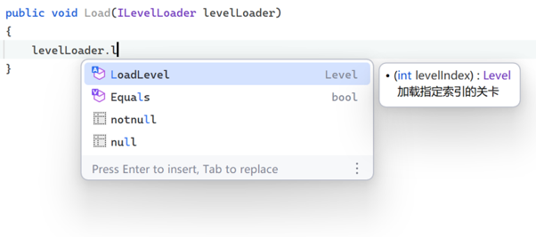
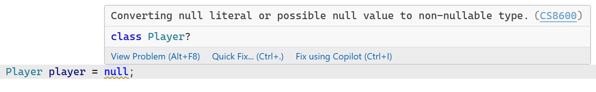
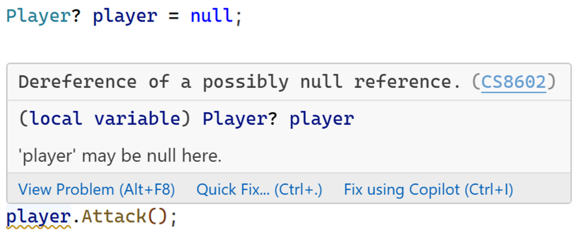
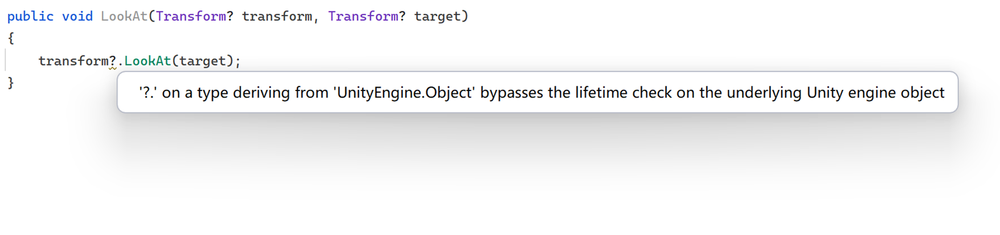
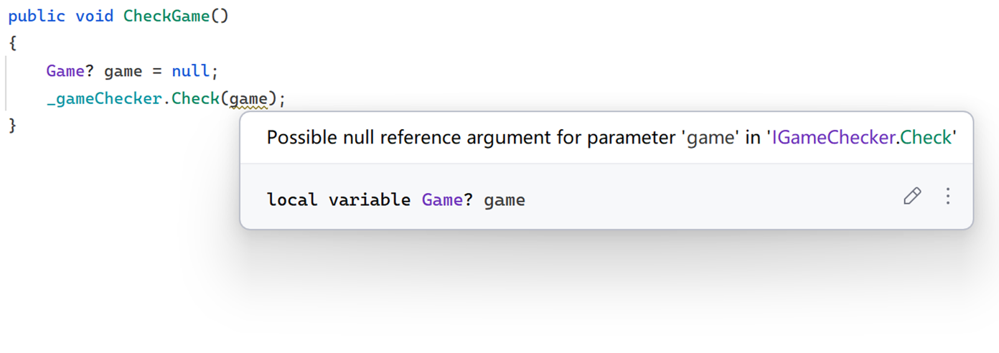
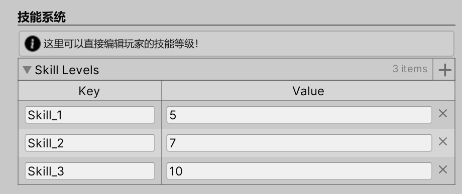
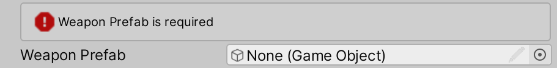

# Unity 开发技巧
**文档部分内容及示例代码由 AI 生成，可能存在不准确或不适用之处。**
## 目录
- [命名](#命名)
- [访问修饰符](#访问修饰符)
- [方法](#方法)
- [变量](#变量)
- [注释](#注释)
- [空引用检查](#空引用检查)
- [格式化字符串](#格式化字符串)
- [条件编译](#条件编译)
- [包管理](#包管理)
- [编辑器拓展](#编辑器拓展)
- [资源管理](#资源管理)
- [动画](#动画)
## 命名
在 Unity 开发中，我们遵循一套行业广泛认可的命名约定，主要是基于微软的 C# 命名指南。
- 类、结构体、枚举、方法、公开成员使用 `PascalCase` 命名，所有单词首字母大写（例如 `PlayerController`）。
- 接口使用 `PascalCase` 命名，前缀加 `I` 表示这是一个接口（例如 `IPlayerController`）。
- 局部变量与方法参数使用 `camelCase` 命名，第一个单词的首字母小写（例如 `playerCount`）。
- 私有字段使用 `_camelCase` 命名，表示这是一个成员变量，与方法参数区分。

    ```csharp
    private float _currentHealth; // .NET
    private float m_CurrentHealth; // Unity

    public void SetCurrentHealth(float currentHealth) => _currentHealth = currentHealth;
    ```
不使用拼音命名，中文里同音字太多了，`jiNeng` 到底是 “技能” 还是 “机能” ？`shiYong` 是 “使用” 还是 “试用” ？这种歧义会给阅读者带来困惑。
```csharp
// 使用英文命名，且名称应具有描述性
public void Attack(int damage);
```
## 访问修饰符
根据需要设置成员的访问修饰符，而不是将所有成员都设置为 `public`。

把所有东西都设为 `public`，相当于把你家的所有房门、抽屉、保险箱全部敞开，钥匙还挂在门上。 短期内你拿东西确实方便了，但长期来看，整个家会乱成一团，东西会莫名其妙地丢失或损坏。

外部代码可以随意调用和修改类的状态，可能导致意想不到的 Bug 或安全隐患。例如，一些只供内部调用的辅助方法被外部直接调用，可能导致程序逻辑异常。
```csharp
public bool TryMove(Vector3 position)
{
    if (!ValidatePosition(position))
        return false;

    MoveTo(position); 
    return true;
}

// 不应允许外部直接调用
public void MoveTo(Vector3 position) 
{
    // 移动物体
}
```
将方法修改为 `private` 或 `protected` , 外部调用时只需要考虑调用 `public` 方法，而不会被其他内部方法干扰导致调用错误。
```csharp
// 不需要判断调用 TryMove 还是 MoveTo
public bool TryMove(Vector3 position)
{
    if (!ValidatePosition(position))
        return false;

    MoveTo(position); 
    return true;
}

protected void MoveTo(Vector3 position) 
{
    // 移动物体
}
```
尽量不将字段设为 `public` 供外部调用。例如你有一个 `public float Speed` 字段在你的 `PlayerController` 脚本里。项目初期，很多脚本都直接这样用：`player.Speed = 10f` 。

几个月后，产品经理要求：当玩家速度改变时，需要同时更新 `Animator` 的 `speed` 参数，并播放一个加速的音效。

现在你头大了，因为 `speed` 是 `public` 的，你必须找到项目中所有直接给 `player.speed` 赋值的地方，然后在每一处都加上更新动画和播放音效的代码。这绝对是一场噩梦，而且很容易遗漏。

如果一开始就用属性或方法来封装它，你只需要修改一处地方：
```csharp
public float Speed
{
    set
    {
        _speed = value;
        // 更新 speed 参数并播放音效 
        _animator.SetFloat("speed", _speed);
        _audioSource.PlayOneShot(_speedUpSound);
    }
    get => _speed;
}
```
很多 Unity 开发者用 `public` 的唯一目的，就是为了能在 Inspector 面板里看到并调整这个变量。这是一个非常普遍的误解。

正确的做法是使用 `SerializeField` 特性：
```csharp
// 我希望在 Inspector 里设置射速，但我不希望其他脚本随意修改它
[SerializeField]
private float _fireRate = 0.5f;

// 我希望其他脚本能读取射速，但不能写入
public float FireRate => _fireRate;
```
## 方法
你在读一段代码，如果它是一条笔直的大路，你一眼就能看到头。但如果它是一个有着无数岔路和地下室的迷宫呢？
```csharp
// 典型的 “意大利面条式” 代码，或者叫 “箭头代码”
void SomeFunction()
{
    if (conditionA)
    {
        // ... 一些代码 ...
        if (conditionB)
        {
            // ... 更多代码 ...
            for (int i = 0; i < 10; i++)
            {
                if (conditionC)
                {
                    // ... 救命，我在哪？...
                    if (conditionD)
                    {
                        // ... 别看了，你自己都写不出这么烂的代码 ...
                        // 真正的逻辑在这里
                    }
                }
            }
        }
        else
        {
            // ... conditionB 的 else 分支在这里，你还记得 conditionA 是什么吗？ ...
        }
    }
}
```
每多一层嵌套，你的大脑就需要多记住一个上下文条件。读到最内层时，你必须同时记住 `conditionA`、`conditionB`、`i` 的值以及 `conditionC` 都为 true。这极大地增加了理解代码的 “认知负担”。

需求变更了，要在这个逻辑里加一个 `conditionE` 怎么办？或者要修改 `conditionB` 为 `false` 时的逻辑？你得像拆弹专家一样，小心翼翼地找到对应的 `if else` 代码块，任何一个大括号的错位都可能引发雪崩式的 Bug。

逻辑如此复杂，非常容易在某个分支里漏掉一些情况，或者写出错误的处理。比如，你可能在某个内层 `if` 里修改了一个变量，却忘了在外层 `else` 里把它重置回来。这种 Bug 极难调试，因为你需要模拟一套非常特定的条件才能复现它。

嵌套最深处的那段核心逻辑，被层层 “包裹”，你根本无法把它抽出来给别的地方用。它和外部的条件焊死在了一起。

提早返回是最简单、最常用、最有效的一招。与其用一个大的 `if` 包住所有正常逻辑，不如先处理掉所有的异常或特殊情况，然后直接 `return` 或 `continue`。

大量嵌套：
```csharp 
void PlayerAttack(Enemy target)
{
    if (player.IsAlive)
    {
        if (target != null)
        {
            if (target.IsVulnerable)
            {
                if (Vector3.Distance(player.position, target.position) < attackRange)
                {
                    // 核心逻辑：造成伤害
                    target.TakeDamage(player.damage);
                }
            }
        }
    }
}
```
使用提早返回：
```csharp
void PlayerAttack(Enemy target)
{
    // 一系列 “哨兵” 检查，不满足条件就直接 “滚蛋”
    if (!player.IsAlive) return;
    if (target == null) return;
    if (!target.IsVulnerable) return;
    if (Vector3.Distance(player.position, target.position) >= attackRange) return;

    // 所有检查都通过了，这里是清晰、扁平的核心逻辑
    target.TakeDamage(player.damage);
}
```
当一个函数太长，或者一部分代码块在做一个独立的事情时，果断把它抽成一个新方法。给这个新方法起一个能 “自解释” 的好名字。

所有功能在 `Update` 里一锅炖：
```csharp
void Update()
{
    // --- 处理玩家移动 ---
    if (Input.GetKey(KeyCode.W))
    {
        // ... 一大堆移动计算代码 ...
        // ... 动画状态更新 ...
    }

    // --- 处理玩家攻击 ---
    if (Input.GetKeyDown(KeyCode.Mouse0))
    {
        // ... 一大堆射线检测、寻找目标的代码 ...
        // ... 调用攻击逻辑 ...
    }

    // --- 处理血量恢复 ---
    if (health < maxHealth)
    {
        // ... 计时器、回血逻辑 ...
    }
}
```
将功能提取为新的方法，逻辑清晰：
```csharp
void Update()
{
    HandleMovement();
    HandleAttack();
    HandleHealthRegeneration();
}

private void HandleMovement()
{
    if (!Input.GetKey(KeyCode.W)) return;

    // 只关心移动逻辑
}

private void HandleAttack()
{
    if (!Input.GetKeyDown(KeyCode.Mouse0)) return;

    // 只关心攻击逻辑
}

private void HandleHealthRegeneration()
{
    if (health >= maxHealth) return;
        
    // 只关心回血逻辑
}
```
## 类
一个类不应承担过多的职责，例如你正在开发一个玩家角色，你创建了一个 `Player` 脚本。一开始，你可能觉得把所有逻辑都放在这里很方便：
```csharp
// 一个承担大量职责的 “上帝类”
public class Player : MonoBehaviour
{
    // 职责1: 玩家属性
    public int health = 100;
    public float speed = 5f;
    public int score = 0;

    // 职责2: 输入处理
    void Update()
    {
        if (Input.GetKeyDown(KeyCode.W)) {
            // ...
        }
        if (Input.GetButtonDown("Fire1")) {
            // ...
        }
    }

    // 职责3: 角色移动
    void FixedUpdate()
    {
        // ... 处理移动和物理 ...
    }

    // 职责4: 战斗逻辑
    public void TakeDamage(int amount)
    {
        health -= amount;
        // ... 播放受伤动画和音效 ...
        if (health <= 0) {
            Die();
        }
    }

    public void Fire() {
        // ... 开火逻辑 ...
    }

    // 职责5: 动画控制
    public void UpdateAnimation() {
        // ... 根据状态更新动画 ...
    }

    // 职责6: 死亡处理
    private void Die() {
        // ... 死亡逻辑，播放动画，显示UI ...
    }

    // 可能还有更多职责：音效、数据持久化、UI交互...
}
```
几千行的 `Player` 脚本会成为一场噩梦。当你只想修改 “开火” 逻辑时，却要在一大堆不相关的代码（如移动、动画、生命值）中寻找，非常困难且容易出错。

假如你想创建一个同样可以移动和攻击，但不具备玩家得分和复杂动画的敌人，你几乎无法复用 `Player` 里的任何代码。你不得不复制粘贴，然后删改，这会导致代码冗余和新的维护问题。

对于上面那个臃肿的 `Player`，我们可以这样拆分：
- `PlayerInput` 脚本负责监听输入。
- `PlayerMovement` 脚本获取 `PlayerInput` 的输入来执行移动。
- `PlayerCombat` 脚本处理攻击和战斗逻辑，并将战斗处理结果通过事件发送。
- `PlayerAnimation` 脚本和 `PlayerAudio` 脚本通过 `PlayerCombat` 的事件处理动画状态和播放音效。
- `PlayerHealth` 脚本管理生命值，并提供受伤和死亡的接口和事件。
## 变量
使用变量来获取数值，而不是在代码中到处写入 “魔法值” 。

简单来说，“魔法值” 是指在代码中直接使用的、没有经过任何解释或命名的硬编码数值。

它就像一张来历不明的纸条，上面只写着一个数字 “7”。这个 “7” 是什么意思？是代表一周有 7 天？玩家最多能带 7 个道具？还是角色的攻击力是 7 ？没人知道。它就像魔法一样凭空出现，充满了神秘感，所以我们叫它 “魔法值” 。

这些是直接写在代码中的具体数值，没有用具名的常量或变量表示。虽然它们在短期内可能看起来方便，但在长期维护中往往会带来问题，因为数字的意义可能对阅读代码的人来说不清晰。例如：
```csharp
// ❌ 充满魔法值的坏代码
public class PlayerController : MonoBehaviour
{
    void Update()
    {
        // 这是什么？玩家移动速度？
        transform.Translate(Vector3.forward * 5.0f * Time.deltaTime);

        if (health < 20)
        {
            // 20 又是什么？低血量警告阈值？
            // 0.8f 是什么？低血量时的减速惩罚系数？
            speedModifier = 0.8f; 
        }

        if (playerState == 2)
        {
            // 2？！玩家状态 2 是什么？是 “跳跃中” 还是 “已阵亡” ？
            // 这是最糟糕的一种魔法值！
        }
    }
}
```
这段代码里的 `5.0f`、`20`、`0.8f`、`2` 全是魔法值。对于一个不熟悉这段代码的人（甚至是你自己，一个月后再回来看），完全无法理解这些数字的业务含义，维护起来就是一场灾难。

如果产品经理说：“我觉得玩家跑得太慢了，把速度从 `5.0f` 提升到 `5.5f` 吧。” 你需要做什么？你需要在整个项目中搜索所有写死的 `5.0f`，然后一个个判断哪个是代表玩家速度，哪个又可能是敌人的速度，或者是一个完全不相干的定时器时长。

如果一个数值在程序运行期间是绝对不会改变的，比如数学常数、转换因子等。使用 `const` 或 `static readonly`。
```csharp
// ✅ 正确做法
public const float PI = 3.14159f;
public static readonly Color WarningColor = Color.Yellow; // readonly 可以在构造时赋值
```
对于代表 “状态” 的整数：使用 `enum`
```csharp
// ✅ 最佳实践：定义一个枚举
public enum PlayerState
{
    Idle,      // 值为 0
    Walking,   // 值为 1
    Running,   // 值为 2
    Jumping    // 值为 3
}

// 在代码中使用，清晰、安全、易读
if (currentState == PlayerState.Running)
{
    // ... 做奔跑相关的事
}
```
需要动态修改的数值，将其序列化。
```csharp
// ✅ Unity 的正确姿势
[Serializable]
public class PlayerSettings
{
    [Header("Movement Settings")]
    [Tooltip("玩家的基础移动速度")] // 加上 Tooltip，鼠标悬停有提示，非常专业
    [SerializeField] 
    private float moveSpeed = 5.0f;

    [Header("Health Settings")]
    [SerializeField] 
    private float lowHealthThreshold = 20f;
    [Range(0, 1)] // 使用 Range 属性，可以在 Inspector 里拖动滑块，防止填错
    [SerializeField] 
    private float lowHealthSpeedModifier = 0.8f;
}
```
## 注释
在 c# 中，使用 `///` 生成文档注释。
```csharp
/// <summary>
/// 加载指定索引的关卡
/// </summary>
/// <param name="levelIndex">关卡索引，从 1 开始计数</param>
/// <returns>关卡实例</returns>
public Level LoadLevel(int levelIndex);
```
编译器会解析这些特殊格式的注释，在你写代码时给你提供有用的智能提示。


## 空引用检查
在 c# 中，`NullReferenceException` 是指程序试图访问一个空对象引用时发生的错误。这是开发中最常见的错误之一。为了解决这个问题，C# 8.0 引入了 “可空引用类型” 的概念。

不带 `?` 的引用类型：编译器会认为它不可以为 null。如果你试图给它赋值 null，编译器会给你一个警告。



带 `?` 的引用类型：你明确声明了这个变量可以为 null。因此，当你要使用它（比如调用它的方法或访问它的属性）之前，编译器会强制你先进行 null 检查，否则就会给你警告。



Unity 默认没有启用可空引用类型，需要在 c# 文件中添加编译指令 `#nullable enable` 或在项目文件夹下添加 Directory.Build.props 文件。
```xml
<Project>
  <PropertyGroup>
    <Nullable>enable</Nullable>
  </PropertyGroup>
</Project>
```
c# 的 null 运算符（例如 `??`，`?.` ）只检查 c# 对象是否为 null。它无法调用 `UnityEngine.Object` 重载过的 `==` 和 `!=` 运算符。
```csharp
public static bool operator ==(Object x, Object y) => Object.CompareBaseObjects(x, y);

public static bool operator !=(Object x, Object y) => !Object.CompareBaseObjects(x, y);
```
当 native 对象被销毁后，托管的 c# 对象可能并不为 null。因此不应使用 null 运算符判断对象是否为 null。


## 格式化字符串
c# 对字符串格式化时，默认会使用 `CultureInfo.CurrentCulture` 对不同的地区进行格式化（例如数字，时间和货币等）。

当 `CurrentCulture` 发生变化时，相同的数字可能格式化成不同的字符串。
```csharp
var number = 123.4;
CultureInfo.CurrentCulture = new("fr-FR");
var str = number.ToString();
Console.WriteLine($"str: {str}"); // 输出为 123,4

CultureInfo.CurrentCulture = new("en-US");
Console.WriteLine($"number: {double.Parse(str)}"); // 解析为 1234，与 number 的值不相等
```
`CultureInfo.InvariantCulture` 是一个与地区无关的 `CultureInfo`。它提供了一套稳定、统一、可预测的格式，专门用于需要格式化和解析字符串的场景。
```csharp
CultureInfo.CurrentCulture = new("fr-FR");
var str = number.ToString(CultureInfo.InvariantCulture);
Console.WriteLine($"str: {str}"); // 输出为 123.4

CultureInfo.CurrentCulture = new("en-US");
Console.WriteLine($"number: {double.Parse(str, CultureInfo.InvariantCulture)}"); // 解析为 123.4，与 number 的值相等
```
## 条件编译
条件编译允许你告诉编译器在编译代码时，根据你设定的条件，只包含或排除某些代码块。

你可以把它想象成一份有多项选择的 “构建说明书” 。例如，这份说明书上写着：
- 如果目标是手机，就加入 “触摸屏操作” 这段代码。
- 如果目标是 PC，就加入 “键鼠操作” 这段代码。
- 如果是在 Unity 编辑器里，就加入 “调试工具” 这段代码，但最终打包时不要加进去。

这样一来，你最终得到的应用程序（.apk，.exe）会非常 “干净”，只包含它在该平台上真正需要的代码，减小了包体大小，也避免了在不兼容的平台上执行错误的代码。

它的核心语法是使用 C# 的预处理指令，主要是：`#if`， `#elif`，`#else` 和 `#endif`。

一个最基础的例子：
```csharp
void Update()
{
#if UNITY_ANDROID
    // 这里是只在 Android 平台才会编译和执行的代码
    HandleTouchInput();
#elif UNITY_STANDALONE
    // 这里是只在 PC, Mac, 或 Linux 平台才会编译和执行的代码
    HandleMouseAndKeyboardInput();
#else
    // 不支持的平台，抛出异常
    throw new PlatformNotSupportedException();
#endif
}
```
另一个至关重要的用途，很多代码只是为了方便编辑器开发和调试，不应该被打包到最终发布的游戏中：
```csharp
void Update()
{
#if UNITY_EDITOR
    // 这个作弊代码只会在编辑器里生效
    if (Input.GetKeyDown(KeyCode.F1))
    {
        player.FullHeal();
        Debug.Log("作弊：生命值已加满！");
    }
#endif
}
```
如果你的游戏有测试版本和正式版本，它们共享大部分代码，只有少量功能差异。你可以自定义一个编译符号来控制。
1. 在 Project Settings -> Player -> Other Settings 中，找到 Scripting Define Symbols。
2. 在这里添加一个自定义的符号，例如 `TEST_VERSION`。
3. 在代码中这样使用：
    ```csharp
    void SomeComplexFunction()
    {
    #if TEST_VERSION
        ShowTestUI();
    #endif
        // ... 正常的功能代码 ...
    }
    ```
也可以使用脚本调用 `PlayerSettings.SetScriptingDefineSymbols` 实现自动化设置。

使用 `const bool` 区分版本无法保证不使用的代码被完全排除（例如某些库在特定平台无法编译），也不方便自动化设置版本。
## 包管理
优先考虑使用 UPM（ Unity Package Manager ） 而不是 .unitypackage 文件（并不是所有库与插件都支持 UPM ）。

Unity 常用的包是 .unitypackage 文件，其本质上就是一个压缩包（类似 .zip）。你把一堆 Assets（脚本、模型、贴图、预制体……）打包进去，然后拿到另一个项目里解压。

所有导入的资源都变成了你 Assets 文件夹下的实体文件。第三方库、插件、美术资源……所有东西都混在一起，提交到你的 Git 或 SVN 仓库里。你的仓库会变得异常庞大，clone 和 pull 的速度慢如蜗牛。

如何知道导入的 MyAwesomeTool.unitypackage 是 1.0 版本还是 1.1 版本？如果发布了新版，需要先手动删除旧的文件（天知道会不会删错或删漏），再导入新的。这极易出错，导致项目混乱。

你无法一目了然地看到项目里有哪些第三方包，哪些版本过时了需要更新。一切都得靠手动管理和人脑记忆。

UPM 是一个依赖管理系统，如果你用过前端的 npm、Java 的 Maven 或者 .NET 的 NuGet，你会感到非常亲切。UPM 就是 Unity 世界里的 npm。

在 Packages 文件夹里有一个核心文件：manifest.json。这个文件就像你的借书卡，它用文本清晰地记录了：“我的项目需要以下这些包，以及它们的指定版本号。”

除了从官方或私有仓库下载，UPM 还支持直接从 Git URL、甚至是本地文件夹加载包。这意味着你可以把公司的通用模块做成一个 Git 仓库，在多个项目中直接引用。

OpenUPM 是一个由社区驱动的、开放的、免费的 UPM 软件包仓库。它收录了大量官方仓库里没有的优秀开源包，并允许你用标准的 UPM 工作流来安装和管理它们。

通过 npm 安装 openupm-cli 后在项目根目录执行以下命令即可安装包（例如 External Dependency Manager for Unity ）：
```
openupm add com.google.external-dependency-manager
```
还可以安装一些转换为 UPM 包的 NuGet 包（例如 morelinq ）：
```
openupm add morelinq
```
## 编辑器拓展
Odin Inspector，Odin Serializer 和 Odin Validator 是 Unity 插件，它们可以快速实现 Unity 编辑器功能扩展

使用 Odin Inspector，你不再需要创建 Editor 文件夹和编写 `CustomEditor` 脚本。你只需要在你的 `MonoBehaviour` 或 `ScriptableObject` 脚本里，给字段、属性或方法加上 `[Attribute]` 即可。这让你的运行时代码和编辑器代码高度统一，维护起来极其方便。
```csharp
[Title("测试工具")]
[Button(ButtonSizes.Large, Name = "一键满血满蓝")] // 创建一个大按钮
private void HealToFull()
{
    health = maxHealth;
    mana = maxMana;
}
```


Unity 默认不支持序列化 `Dictionary`、`HashSet`、`System.Object` 引用等。这在设计复杂数据结构时是个巨大的痛点。Odin Serializer 可以完美解决这个问题，让你可以在 Inspector 中直接编辑字典。
```csharp
[SerializeField]
[Title("技能系统")]
[InfoBox("这里可以直接编辑玩家的技能等级！")] // 加一个信息提示框
// Odin 的魔法：让字典可以在 Inspector 中显示和编辑！
private Dictionary<string, int> skillLevels = new();
```


Odin Validator 提供了一整套验证特性。比如 `[Required]` (确保某个字段不为空)、`[ValidateInput]` (自定义验证逻辑)、`[MinValue]` 和 `[MaxValue]` 等。
```csharp
[SerializeField]
[Required] // 要求不可以为 null 的类型必须赋值
private GameObject _weaponPrefab = null!;
```

## 资源管理
手动打包 AB（ AssetBundle ）包时，一个 Prefab 依赖一个 Material，这个 Material 依赖一个 Shader 和一个 Texture。在打包时，你必须手动处理这些依赖关系。

可能出现两个不同的 AB 包都包含了同一个贴图，导致包体和内存都无故增大。或者 Prefab 打包了，但它依赖的 Material 没打进同一个包，也没在依赖包里，运行时直接变 “粉红色小方块” 。

你需要写大量的打包脚本，并且每次资源结构变动，脚本可能都要跟着改，维护成本极高。

加载一个资源，你需要先 `AssetBundle.LoadFromFileAsync` 加载 AB 包，然后从包里 `bundle.LoadAssetAsync` 加载具体资源。整个过程是异步的，代码写起来很啰嗦。`AssetBundle.Unload(bool unloadAllLoadedObjects)` 是个大坑。`true` 还是 `false` ？选错了，要么内存泄漏，要么你把还在用的资源给卸载了，导致场景中的对象损坏。你需要自己实现一套复杂的引用计数系统来跟踪哪个资源正在被多少个对象使用。

使用 Addressables，你只需要把 Prefab 标记为 "Addressable"，系统会自动分析它的整个依赖链（材质、贴图、Shader、动画...），然后智能地将公共依赖项打包到独立的共享 AB 包中。

Addressables 自动处理所有资源的引用计数。当你加载一个资源，它的引用计数 +1。当你调用 `Addressables.Release(handle)` 释放它时，计数 -1。当计数归零时，系统会自动、安全地卸载该资源及其所在的 AB 包，这从根本上消除了绝大多数内存管理错误。

**Addressables 在不同的机器环境中打包可能计算出不同的 Hash 值**，有远程下载需求的可以考虑在同一台机器上打包，不在版本控制系统中排除 Addressables 打包的结果并一起 Push。
## 动画
使用 DOTween 实现简单的动画效果，DOTween 是一个功能强大、高效且易于使用的 Unity 动画补间引擎。“补间”是指在两个状态之间创建平滑过渡的动画。DOTween 可以让您用非常少的代码，非常方便地创建出各种复杂的动画效果，例如移动、旋转、缩放、颜色变化、UI 动画等等。

DOTween 可以通过链式调用的方式，将多个动画设置和回调函数写在一行代码里，使代码更加紧凑和易读。
```csharp
// 让一个物体在1秒内移动到新位置
transform.DOMove(new Vector3(2, 2, 2), 1).SetEase(Ease.OutQuad).OnComplete(MyCallback);
```
`Sequence` 是 DOTween 最强大的功能之一，它本身不执行动画，但可以将多个独立的动画（我们称之为 Tween）按照你设定的顺序和时间点组合起来，形成一个整体的、可控的动画流程。
```csharp
// 1. 创建 Sequence
Sequence entrySequence = DOTween.Sequence();

// 2. 编排动画
entrySequence
    // 在0.5秒内淡入
    .Append(panelCanvasGroup.DOFade(1, 0.5f))
    // 同时，从0.8倍大小放大到1倍，使用 Ease.OutBack 产生回弹效果
    .Join(panelTransform.DOScale(1, 0.5f).SetEase(Ease.OutBack))
    // 等待0.1秒
    .AppendInterval(0.1f)
    // 让按钮的 Transform 左右晃动一下
    .Append(myButton.transform.DOShakePosition(0.4f, new Vector3(20, 0, 0), 10, 90));
```
实现相对复杂的动画需要使用到 Unity 的 `AnimationClip`，但是 Mecanim 动画系统使用起来相当繁琐。任何一个新的动画或行为，通常都需要打开 Animator 窗口，创建新的 State，设置新的 Parameter，再拉好所有的 Transition 连线。当角色技能繁多（例如有50个技能的RPG角色）时，Animator Controller 会变成一张巨大且难以维护的“意大利面条式”的灾难图。

在复杂项目中，Mecanim 的状态逻辑会变得非常分散。你得同时检查代码里是否正确设置了 Parameter，Animator Controller 里的 Transition 条件是否正确，State 本身的配置是否正确。

Animancer 是一个以代码为核心、绕过 Mecanim 来直接控制动画播放的插件。它让你能像播放音效一样，通过一行代码 `animancer.Play(clip)` 来精确、动态地播放任何动画片段，从而获得极高的灵活性和可维护性。

Mecanim 逻辑是 “我进入了某个状态，所以播放这个动画”。你的代码不直接控制动画，而是通过改变 bool, float, int, trigger 等参数来“请求”状态机切换状态。动画的播放权在 Animator Controller 这个“黑盒”里。

Animancer 的逻辑是 “我要播放这个动画，所以我执行这行代码”。代码拥有绝对的控制权，动画的播放逻辑完全透明、直接，不存在任何中间层。

使用 Animancer 时，只需要在你的代码里拿到这个 AnimationClip，然后在需要的时候 Play 它就行了。完全不需要打开任何图形化编辑器。Animancer 完美解决了 Mecanim 的 “状态爆炸” 问题。你不需要为每个技能、每个动作都创建一个可视化的 State，你的状态就是你的代码逻辑本身，清晰且易于扩展。

可以直接在脚本中动态添加事件并设置过渡时间：
```csharp
// 添加一个事件到动画
_runAnimation.Events.Add(0.5f, () => Debug.Log("The running animation is halfway done"));
// 播放动画，0.25f 是过渡时间
_animancer.Play(_runAnimation, 0.25f);
```
## 异步编程
使用 UniTask 执行异步任务，UniTask 是一个为 Unity 专门设计和优化的、高性能的开源异步解决方案。它旨在完全取代协程和在 Unity 中直接使用 `Task`。它基于 struct 设计，几乎没有内存分配。

协程无法直接返回一个值 (IEnumerator 的返回类型是固定的)。你需要通过回调函数或引用传参等笨拙的方式来获取结果。UniTask 使用 UniTask<T>，可以像普通函数一样自然地 return 结果。

你无法在 try-catch 块中包裹一个 yield return 来捕获异步操作中发生的异常。而 UniTask 基于 async/await，可以完全使用标准的 try-catch-finally 语法，代码健壮性天差地别。

协程无法直接获取结果，也无法try-catch：
```csharp
void Start()
{
    StartCoroutine(FetchDataCoroutine());
}

IEnumerator FetchDataCoroutine()
{
    var request = UnityWebRequest.Get("...");
    yield return request.SendWebRequest(); // 如果这里出错了，try-catch抓不到

    if (request.result != UnityWebRequest.Result.Success)
    {
        Debug.LogError("Error!");
    }
    else
    {
        // 如何把 request.downloadHandler.text 返回给调用者？很麻烦！
        string result = request.downloadHandler.text;
        // Do something with result...
    }
}
```
使用 UniTask 获取结果，代码清晰、健壮、高性能：
```csharp
async void Start()
{
    try
    {
        var result = await FetchDataAsync();
        Debug.Log("Data fetched: " + result);
    }
    catch (Exception e)
    {
        Debug.LogError("Failed to fetch data: " + e.Message);
    }
}

async UniTask<string> FetchDataAsync()
{
    var request = UnityWebRequest.Get("...");
    // await可以被try-catch捕获，并且直接返回结果
    var operation = await request.SendWebRequest();
    return operation.downloadHandler.text;
}
```

Task 的 await 之后，代码可能会在任意一个后台线程上恢复执行。如果你此时尝试访问 Unity API（如 transform.position），程序就会崩溃！你需要手动处理线程同步。而 UniTask 默认总是在 Unity 主线程上恢复执行，这正是 Unity 开发所需要的行为，安全且直观。

Task 的调度和状态机在设计上没有为游戏循环进行优化，会带来不必要的开销。UniTask 的调度器直接与 Unity 的 PlayerLoop (Update, LateUpdate 等) 绑定，极其轻量和高效。

将协程和 Task 替换成 UniTask：
```csharp
// 等待 Unity 的 AsyncObject
var asset = await Resources.LoadAsync<TextAsset>("foo");
var txt = (await UnityWebRequest.Get("https://...").SendWebRequest()).downloadHandler.text;
await SceneManager.LoadSceneAsync("scene2");

// 替换 yield return null
await UniTask.Yield();

// 等待 IEnumerator 协程
await FooCoroutineEnumerator();

// 等待一个标准任务
await Task.Run(() => 100);
```

支持其他插件：
```csharp
// 等待 Addressables 异步加载
await Addressables.LoadAssetAsync<TextAsset>("foo");

// 等待 DOTween 动画播放完成
await transform.DOMoveX(2, 10);
```