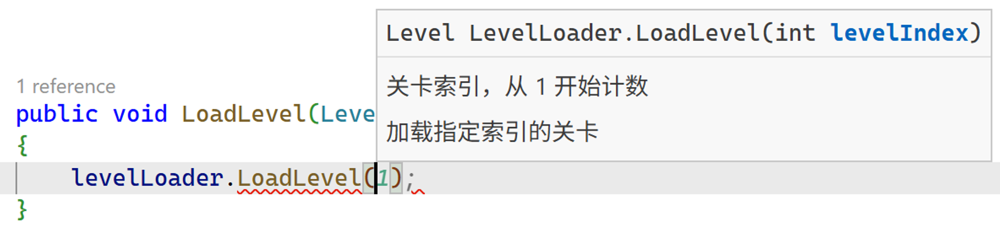

# Unity 开发技巧
## 目录
- [命名](#命名)
- [访问修饰符](#访问修饰符)
- [方法](#方法)
## 命名
在 Unity 开发中，我们遵循一套行业广泛认可的命名约定，主要是基于微软的 C# 命名指南。
- 类、结构体、枚举、方法、公开成员使用 `PascalCase` 命名，所有单词首字母大写（例如 `PlayerController`）。
- 接口使用 `PascalCase` 命名，前缀加 `I` 表示这是一个接口（例如 `IPlayerController`）。
- 局部变量与方法参数使用 `camelCase` 命名，第一个单词的首字母小写（例如 `playerCount`）。
- 私有字段使用 `_camelCase` 命名，表示这是一个成员变量，与方法参数区分。

    ```csharp
    private float _currentHealth; // .NET
    private float m_CurrentHealth; // Unity

    public void SetCurrentHealth(float currentHealth) => _currentHealth = currentHealth;
    ```
不使用拼音命名，中文里同音字太多了，`jiNeng` 到底是 “技能” 还是 “机能” ？`shiYong` 是 “使用” 还是 “试用” ？这种歧义会给阅读者带来困惑。
```csharp
// 使用英文命名，且名称应具有描述性
public void Attack(int damage);
```
## 访问修饰符
根据需要设置成员的访问修饰符，而不是将所有成员都设置为 `public`。

把所有东西都设为 `public`，相当于把你家的所有房门、抽屉、保险箱全部敞开，钥匙还挂在门上。 短期内你拿东西确实方便了，但长期来看，整个家会乱成一团，东西会莫名其妙地丢失或损坏。

外部代码可以随意调用和修改类的状态，可能导致意想不到的 Bug 或安全隐患。例如，一些只供内部调用的辅助方法被外部直接调用，可能导致程序逻辑异常。
```csharp
public bool TryMove(Vector3 position)
{
    if (!ValidatePosition(position))
        return false;

    MoveTo(position); 
    return true;
}

// 不应允许外部直接调用
public void MoveTo(Vector3 position) 
{
    // 移动物体
}
```
将方法修改为 `private` 或 `protected` , 外部调用时只需要考虑调用 `public` 方法，而不会被其他内部方法干扰导致调用错误。
```csharp
// 不需要判断调用 TryMove 还是 MoveTo
public bool TryMove(Vector3 position)
{
    if (!ValidatePosition(position))
        return false;

    MoveTo(position); 
    return true;
}

protected void MoveTo(Vector3 position) 
{
    // 移动物体
}
```
尽量不将字段设为 `public` 供外部调用。假如你有一个 `public float Speed` 字段在你的 `PlayerController` 脚本里。项目初期，很多脚本都直接这样用：`player.Speed = 10f` 。

几个月后，产品经理要求：当玩家速度改变时，需要同时更新 `Animator` 的 `speed` 参数，并播放一个加速的音效。

现在你头大了，因为 `speed` 是 `public` 的，你必须找到项目中所有直接给 `player.speed` 赋值的地方，然后在每一处都加上更新动画和播放音效的代码。这绝对是一场噩梦，而且很容易遗漏。

如果一开始就用属性或方法来封装它，你只需要修改一处地方：
```csharp
public float Speed
{
    set
    {
        _speed = value;
        // 更新 speed 参数并播放音效 
        _animator.SetFloat("speed", _speed);
        _audioSource.PlayOneShot(_speedUpSound);
    }
    get => _speed;
}
```
很多 Unity 开发者用 `public` 的唯一目的，就是为了能在 Inspector 面板里看到并调整这个变量。这是一个非常普遍的误解。

正确的做法是使用 `SerializeField` 特性
```csharp
// 我希望在 Inspector 里设置射速，但我不希望其他脚本随意修改它
[SerializeField]
private float _fireRate = 0.5f;

// 我希望其他脚本能读取射速，但不能写入
public float FireRate => _fireRate;
```
## 方法
你在读一段代码，如果它是一条笔直的大路，你一眼就能看到头。但如果它是一个有着无数岔路和地下室的迷宫呢？
```csharp
// 典型的 “意大利面条式” 代码，或者叫 “箭头代码”
void SomeFunction()
{
    if (conditionA)
    {
        // ... 一些代码 ...
        if (conditionB)
        {
            // ... 更多代码 ...
            for (int i = 0; i < 10; i++)
            {
                if (conditionC)
                {
                    // ... 救命，我在哪？...
                    if (conditionD)
                    {
                        // ... 别看了，你自己都写不出这么烂的代码 ...
                        // 真正的逻辑在这里
                    }
                }
            }
        }
        else
        {
            // ... conditionB 的 else 分支在这里，你还记得 conditionA 是什么吗？ ...
        }
    }
}
```
每多一层嵌套，你的大脑就需要多记住一个上下文条件。读到最内层时，你必须同时记住 `conditionA`、`conditionB`、`i` 的值以及 `conditionC` 都为 true。这极大地增加了理解代码的 “认知负担”。

需求变更了，要在这个逻辑里加一个 `conditionE` 怎么办？或者要修改 `conditionB` 为 `false` 时的逻辑？你得像拆弹专家一样，小心翼翼地找到对应的 `if else` 代码块，任何一个大括号的错位都可能引发雪崩式的 Bug。

逻辑如此复杂，非常容易在某个分支里漏掉一些情况，或者写出错误的处理。比如，你可能在某个内层 `if` 里修改了一个变量，却忘了在外层 `else` 里把它重置回来。这种 Bug 极难调试，因为你需要模拟一套非常特定的条件才能复现它。

嵌套最深处的那段核心逻辑，被层层 “包裹”，你根本无法把它抽出来给别的地方用。它和外部的条件焊死在了一起。

提早返回是最简单、最常用、最有效的一招。与其用一个大的 `if` 包住所有正常逻辑，不如先处理掉所有的异常或特殊情况，然后直接 `return` 或 `continue`。
```csharp
// 大量嵌套
void PlayerAttack(Enemy target)
{
    if (player.IsAlive)
    {
        if (target != null)
        {
            if (target.IsVulnerable)
            {
                if (Vector3.Distance(player.position, target.position) < attackRange)
                {
                    // 核心逻辑：造成伤害
                    target.TakeDamage(player.damage);
                }
            }
        }
    }
}
```
```csharp
// 使用提早返回
void PlayerAttack(Enemy target)
{
    // 一系列 “哨兵” 检查，不满足条件就直接 “滚蛋”
    if (!player.IsAlive) return;
    if (target == null) return;
    if (!target.IsVulnerable) return;
    if (Vector3.Distance(player.position, target.position) >= attackRange) return;

    // 所有检查都通过了，这里是清晰、扁平的核心逻辑
    target.TakeDamage(player.damage);
}
```
当一个函数太长，或者一部分代码块在做一个独立的事情时，果断把它抽成一个新方法。给这个新方法起一个能 “自解释” 的好名字。
```csharp
// Update 里一锅炖
void Update()
{
    // --- 处理玩家移动 ---
    if (Input.GetKey(KeyCode.W))
    {
        // ... 一大堆移动计算代码 ...
        // ... 动画状态更新 ...
    }

    // --- 处理玩家攻击 ---
    if (Input.GetKeyDown(KeyCode.Mouse0))
    {
        // ... 一大堆射线检测、寻找目标的代码 ...
        // ... 调用攻击逻辑 ...
    }

    // --- 处理血量恢复 ---
    if (health < maxHealth)
    {
        // ... 计时器、回血逻辑 ...
    }
}
```
```csharp
// 逻辑清晰
void Update()
{
    HandleMovement();
    HandleAttack();
    HandleHealthRegeneration();
}

private void HandleMovement()
{
    if (!Input.GetKey(KeyCode.W)) return;

    // 只关心移动逻辑
}

private void HandleAttack()
{
    if (!Input.GetKeyDown(KeyCode.Mouse0)) return;

    // 只关心攻击逻辑
}

private void HandleHealthRegeneration()
{
    if (health >= maxHealth) return;
        
    // 只关心回血逻辑
}
```
## 类
如果一个类承担了过多的职责称之为上帝类。

一个上帝类，代码行数可能有上千行，里面混杂着各种代码。当你想修改一个功能或者修复一个 Bug 时，你需要在庞大的代码中找到相关的部分，这非常耗时且容易出错。
```csharp
public class GameManager
{
    public Game GenerateGame();

    public bool CheckGame(Game game);
}
```
与方法类似，可以将不同功能进行拆分，由不同的类或接口实现。
```csharp
public interface IGameGenerator
{ 
    public Game Generate();
}

public interface IGameChecker
{
    public bool Check(Game game);
}
```
通过传入接口进行解耦。
```csharp
public class GameManager
{
    // 无需关注具体实现（例如特殊模式，策略等）
    private IGameGenerator _gameGenerator;
    private IGameChecker _gameChecker;

    public GameManager(IGameGenerator gameGenerator, IGameChecker gameChecker)
    {
        _gameGenerator = gameGenerator;
        _gameChecker = gameChecker;
    }
}

public interface IGameLoader
{ 
    public Game Load();
}

public interface IGameChecker
{
    public bool Check(Game game);
}
```
## 魔法值
简单来说，“魔法值” 是指在代码中直接使用的、没有经过任何解释或命名的硬编码数值。

它就像一张来历不明的纸条，上面只写着一个数字 “7”。这个 “7” 是什么意思？是代表一周有 7 天？玩家最多能带 7 个道具？还是角色的攻击力是 7 ？没人知道。它就像魔法一样凭空出现，充满了神秘感，所以我们叫它 “魔法值” 。

这些是直接写在代码中的具体数值，没有用具名的常量或变量表示。虽然它们在短期内可能看起来方便，但在长期维护中往往会带来问题，因为数字的意义可能对阅读代码的人来说不清晰。例如：
```csharp
// ❌ 充满魔法值的坏代码
public class PlayerController : MonoBehaviour
{
    void Update()
    {
        // 这是什么？玩家移动速度？
        transform.Translate(Vector3.forward * 5.0f * Time.deltaTime);

        if (health < 20)
        {
            // 20又是什么？低血量警告阈值？
            // 0.8f 是什么？低血量时的减速惩罚系数？
            speedModifier = 0.8f; 
        }

        if (playerState == 2)
        {
            // 2？！玩家状态2是什么鬼？是“跳跃中”还是“已阵亡”？
            // 这是最糟糕的一种魔法值！
        }
    }
}
```
这段代码里的 `5.0f`、`20`、`0.8f`、`2` 全是魔法值。对于一个不熟悉这段代码的人（甚至是你自己，一个月后再回来看），完全无法理解这些数字的业务含义，维护起来就是一场灾难。

假设产品经理说：“我们觉得玩家跑得太慢了，把速度从 `5.0f` 提升到 `5.5f` 吧。” 你需要做什么？你需要在整个项目中搜索所有写死的 `5.0f`，然后一个个判断哪个是代表玩家速度，哪个又可能是敌人的速度，或者是一个完全不相干的定时器时长。

如果一个数值在程序运行期间是绝对不会改变的，比如数学常数、转换因子等。使用 `const` 或 `static readonly`。
```csharp
// ✅ 正确做法
private const float PI = 3.14159f;
public static readonly Color WARNING_COLOR = Color.yellow; // readonly可以在构造时赋值
```
对于代表 “状态” 的整数：使用 `enum`
```csharp
// ✅ 最佳实践：定义一个枚举
public enum PlayerState
{
    Idle,      // 值为 0
    Walking,   // 值为 1
    Running,   // 值为 2
    Jumping    // 值为 3
}

// 在代码中使用，清晰、安全、易读
if (currentState == PlayerState.Running)
{
    // ... 做奔跑相关的事
}
```
需要动态更新修改的数值，将其序列化到配置文件。
```csharp
// ✅ Unity 的正确姿势
[Serializable]
public class PlayerConfigure
{
    [Header("Movement Settings")]
    [Tooltip("玩家的基础移动速度")] // 加上 Tooltip，鼠标悬停有提示，非常专业
    [SerializeField] 
    private float moveSpeed = 5.0f;

    [Header("Health Settings")]
    [SerializeField] 
    private float lowHealthThreshold = 20f;
    [Range(0, 1)] // 使用 Range 属性，可以在 Inspector 里拖动滑块，防止填错
    [SerializeField] 
    private float lowHealthSpeedModifier = 0.8f;
}
```
## 注释
在 c# 中，使用 `///` 生成文档注释。
```csharp
/// <summary>
/// 加载指定索引的关卡
/// </summary>
/// <param name="levelIndex">关卡索引，从 1 开始计数</param>
/// <returns>关卡实例</returns>
public Level LoadLevel(int levelIndex);
```
编译器会解析这些特殊格式的注释，在你写代码时给你提供有用的智能提示。


## c# 中的 null 安全检查
在 c# 中，`NullReferenceException` 是指程序试图访问一个空对象引用时发生的错误。这是开发中最常见的错误之一。为了解决这个问题，C# 8.0 引入了 “可空引用类型” 的概念。

不带 `?` 的引用类型：编译器会认为它不可以为 null。如果你试图给它赋值 null，编译器会给你一个警告。


带 `?` 的引用类型：你明确声明了这个变量可以为 null。因此，当你要使用它（比如调用它的方法或访问它的属性）之前，编译器会强制你先进行 null 检查，否则就会给你警告。


Unity 默认没有启用可空引用类型，需要在 c# 文件中添加编译指令 `#nullable enable` 或在项目文件夹下添加 Directory.Build.props 文件。
```xml
<Project>
  <PropertyGroup>
    <Nullable>enable</Nullable>
  </PropertyGroup>
</Project>
```
c# 的 null 运算符（例如 `??`，`?.` ）只检查 c# 对象是否为 null。它无法调用 `UnityEngine.Object` 重载过的 `==` 和 `!=` 运算符。
```csharp
public static bool operator ==(Object x, Object y) => Object.CompareBaseObjects(x, y);

public static bool operator !=(Object x, Object y) => !Object.CompareBaseObjects(x, y);
```
当 native 对象被销毁后，托管的 c# 对象可能并不为 null。因此不应使用 null 运算符判断对象是否为 null。


## 格式化字符串
c# 对字符串格式化时，默认会使用 `CultureInfo.CurrentCulture` 对不同的地区进行格式化（例如数字，时间和货币等）。

当 `CurrentCulture` 发生变化时，相同的数字可能格式化成不同的字符串。
```csharp
var number = 123.4;
CultureInfo.CurrentCulture = new("fr-FR");
var str = number.ToString();
Console.WriteLine($"str: {str}"); // 输出为 123,4

CultureInfo.CurrentCulture = new("en-US");
Console.WriteLine($"number: {double.Parse(str)}"); // 解析为 1234，与 number 的值不相等
```
`CultureInfo.InvariantCulture` 是一个与地区无关的 `CultureInfo`。它提供了一套稳定、统一、可预测的格式，专门用于需要格式化和解析字符串的场景。
```csharp
CultureInfo.CurrentCulture = new("fr-FR");
var str = number.ToString(CultureInfo.InvariantCulture);
Console.WriteLine($"str: {str}"); // 输出为 123.4

CultureInfo.CurrentCulture = new("en-US");
Console.WriteLine($"number: {double.Parse(str, CultureInfo.InvariantCulture)}"); // 解析为 123.4，与 number 的值相等
```
通过这种方式，如果将来业务规则变动（比如低伤害上限为 20），你只需要改一个地方。
## 条件编译
条件编译能让一份代码灵活地适配不同配置（调试/发布、不同框架、功能开关）、在发布版剔除调试日志和断言、减小体积并消除无谓性能损耗，也可打造灰度发布、多目标构建等复杂场景。

用预处理指令的“条件编译”相比代码里写一个 `const bool`，表面上都能在不同配置下控制“这段代码要不要跑”，但条件编译可以控制例如引用程序集、添加特性等。

项目通常会有测试版和正式版，可以使用例如 `TEST_MODE` 编译符号定义只在测试模式下有效的方法
```csharp
#if TEST_MODE
public void TestMethod() { }
#endif
```
在 Unity 中，使用编辑器脚本调用 `PlayerSettings.SetScriptingDefineSymbols` 自动设置编译符号。
## 包管理
openupm

nuget
## 编辑器拓展
odin
## 资源加载
addressables
## 异步编程
unitask